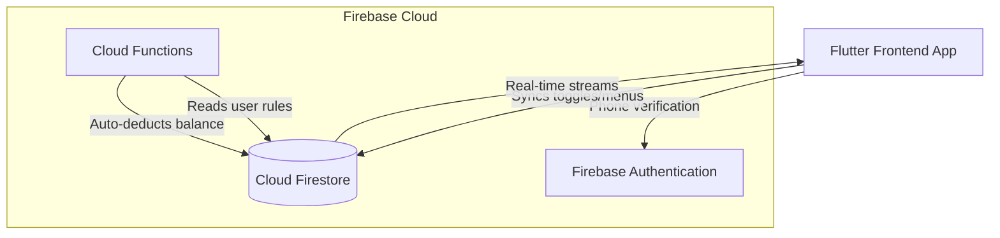

<div align="center">

[College Name]

[Department Name]

Subject: Mobile App Development Lab

**Smart Mess Attendance and Diet Management Mobile Application**

</div>

<br><br><br><br>

**Submitted by:**
[Your Name(s)]  
[Your Roll Number(s)]

**Submitted to:**
[Faculty Name]

**Session:** 2025–26

<div style="page-break-after: always;"></div>

# 2. CERTIFICATE

This is to certify that the project titled “Smart Mess Attendance and Diet Management Mobile Application” submitted by [Your Name(s)], bearing Roll Number(s) [Your Roll Number(s)], in partial fulfillment of the requirements for the Mobile App Development Lab course for the session 2025–26, is a bona fide record of the work carried out under my supervision. 

The project embodies original work and has not been submitted in part or full for any other academic requirement. The candidate(s) has/have demonstrated the necessary dedication and technical proficiency during the development of this mobile application.

<br><br><br><br>

--------------------------  
**[Faculty Name]**  
Project Guide / Faculty  
[Department Name]

<br><br><br><br>

--------------------------  
**[HOD Name]**  
Head of the Department  
[Department Name]

<div style="page-break-after: always;"></div>

# 3. DECLARATION

We hereby declare that the project titled "Smart Mess Attendance and Diet Management Mobile Application" submitted by us for the Mobile App Development Lab is our original work. All the implementation, design, and functionality developed during this project are the result of our own efforts and research under the guidance of our faculty. 

Wherever technical resources, frameworks, or external references have been utilized, they have been duly acknowledged. This project report has not been submitted previously in part or full for the award of any degree or diploma to this or any other university or institution.

<br><br><br><br>

**Date:** [Date]  
**Place:** [Place]  

<br><br>

**Signatures:**

--------------------------  
**[Name 1]** ([Roll Number 1])

--------------------------  
**[Name 2]** ([Roll Number 2])

<div style="page-break-after: always;"></div>

# 4. ACKNOWLEDGEMENT

We would like to express our deepest gratitude to everyone who contributed to the successful completion of this project.

First and foremost, we extend our sincere gratitude to our faculty guide, [Faculty Name], for their continuous support, valuable guidance, and technical insights throughout the development of the "Smart Mess Attendance and Diet Management Mobile Application". Their expertise and constructive feedback were instrumental in shaping the architecture and functionality of this project.

We are highly indebted to the Head of the Department, [HOD Name], and the management of [Institution Name] for providing us with the necessary infrastructure, resources, and an encouraging academic environment to carry out this project successfully.

We also wish to thank our peers and friends who provided their honest feedback during the initial testing phases of the application. Their inputs regarding user experience and practical usability helped us refine the final system. Lastly, gratitude is extended to all those whose direct or indirect support made this endeavor a success.

<div style="page-break-after: always;"></div>

# 5. ABSTRACT

The traditional functioning of student dining halls and mess facilities is largely characterized by manual record-keeping, inefficient communication, and structural disorganization. The core problem lies in the inability to accurately forecast the number of students dining on any given day, which directly leads to either severe food wastage or critical food shortages. Additionally, the manual ledger system utilized for tracking prepaid diets and daily attendance is prone to human error, manipulation, and tedious reconciliation at the end of every month. The "Smart Mess Attendance and Diet Management Mobile Application" is engineered to resolve these pervasive issues by converting the entire physical ecosystem into a seamless digital platform. The application provides two distinct interfaces: one dedicated to the administrative operations of the mess management, and the other designed for the clients or students consuming the meals. The system incorporates an automated availability toggle mechanism, allowing students to preemptively declare their absence before designated cut-off times, enabling accurate meal portion planning. Key features of the application include real-time diet balance tracking, interactive menu management, automated attendance logging, and a robust notification system. Built using the Flutter framework for a cross-platform mobile experience and powered by Firebase services including Authentication, Cloud Firestore, and Cloud Functions, this application eliminates the dependency on unstructured communication channels. By centralizing management, data tracking, and dynamic meal preparation planning, the platform drastically cuts down on manual labor, increases transparency in the billing process, and introduces operational efficiency into an otherwise chaotic industry. 

<div style="page-break-after: always;"></div>

# 6. TABLE OF CONTENTS

[Auto-generate in Word using References > Table of Contents]

1. COVER PAGE
2. CERTIFICATE
3. DECLARATION
4. ACKNOWLEDGEMENT
5. ABSTRACT
6. TABLE OF CONTENTS
7. INTRODUCTION
8. PROBLEM STATEMENT
9. OBJECTIVES OF THE PROJECT
10. SCOPE OF THE PROJECT
11. LITERATURE REVIEW
12. SYSTEM OVERVIEW
13. SYSTEM ARCHITECTURE
14. DATABASE DESIGN
15. MODULE DESCRIPTION
16. WORKING LOGIC
17. IMPLEMENTATION DETAILS
18. RESULTS & OUTPUT
19. ADVANTAGES & LIMITATIONS
20. FUTURE SCOPE & CONCLUSION

<div style="page-break-after: always;"></div>

# 7. INTRODUCTION

The rapid expansion of the education sector and the clustering of students in coaching hubs and university towns have drastically increased the demand for organized private hostels and mess facilities. Thousands of students migrate from their hometowns to pursue their education, bringing an entirely new set of logistical challenges related to daily dining. The provisioning of three nutritious meals a day for hundreds of students is a complex operational task. Historically, this task has been managed using rudimentary systems rooted in pen-and-paper ledgers or simple spreadsheet software. As the scale of these mess operations grows, the fragilities of manual management become alarmingly evident.

Our observation of the grassroots reality stems primarily from experiences in regions like Kota, recognized widely as the coaching capital of the country. In Kota, the student population influx is massive, and almost every student relies on a private mess or tiffin service. Upon closer inspection of these facilities, a distinct pattern of operational chaos emerges. The mess administration relies heavily on physical registers to track attendance. Students form long queues simply to mark themselves present on a ledger before grabbing their plates. At the end of the month, the mess owner must laboriously calculate the number of meals consumed by manually counting the checkmarks or signatures against a pre-paid balance. This process is not just monotonous; it is deeply flawed. Disputes over remaining meal balances are a common occurrence, with students claiming they skipped a meal while the mess owner’s register depicts otherwise.

Furthermore, students frequently travel home, fall ill, or decide to dine out on a whim. The existing mechanism to inform the mess owner of their absence is structurally weak. Usually, students are expected to message the mess owner via WhatsApp or make a phone call hours in advance to cancel a meal. In reality, these messages often get buried in the owner's crowded inbox, or the student simply forgets to communicate. Consequently, the kitchen prepares food based on the total enrolled strength rather than the expected turnout. This lack of automated communication creates a tremendous amount of daily food wastage, which represents a severe financial leak for the operators and a moral concern in general. 

The need for automation is glaringly clear. The unstructured, ad-hoc methods of communication and data logging need to be replaced with a deterministic system that enforces rules and provides real-time reflections of data. The modern student is heavily integrated into the smartphone ecosystem, making a mobile application the most accessible medium for intervention. A centralized mobile application can mathematically solve the forecasting problem by creating hard deadlines for meal cancellations while concurrently providing transparent ledgers for financial tracking.

The motivation behind this project is to architect a scalable software solution that brings dignity and transparency back to this essential service. By developing the "Smart Mess Attendance and Diet Management Mobile Application", we aim to empower both the consumer and the provider. For the student, the motivation is to offer complete visibility over their prepaid diet balance and a frictionless way to manage their schedule. For the mess administrators, the motivation revolves around resource optimization, minimizing operational blind spots, and ultimately running a sophisticated, loss-less enterprise.

<div style="page-break-after: always;"></div>

# 8. PROBLEM STATEMENT

Despite the ubiquity of digital solutions in modern commerce, the local mess and dining services sector remains heavily reliant on outdated manual procedures. This reliance creates a multitude of operational bottlenecks that negatively impact both the mess administrators and their student clients. The core issues demanding immediate resolution can be summarized as follows:

First, manual attendance tracking introduces significant human error and inefficiency. The standard procedure requires students to sign physical registers before consuming a meal. This often leads to long queues during peak dining hours, creating frustration. Additionally, maintaining the integrity of these physical ledgers is difficult; pages can be lost or damaged, and handwriting can be misread, leading to inaccurate end-of-month accounting and subsequent billing disputes between the provider and the client.

Second, the system suffers from a critical communication dependency on ad-hoc platforms, primarily WhatsApp. When a student intends to skip a meal, they are expected to send a message to the mess owner. Mess administrators, who deal with hundreds of such students, find it nearly impossible to manually process these individual cancellations in real-time. Messages are frequently missed or read too late, rendering the entire communication process highly unreliable. 

Third, and perhaps most vitally from an economic and ethical standpoint, the absence of an accurate predictive mechanism results in substantial food wastage. Because mess operators cannot accurately predict the daily turnout—due to the aforementioned communication failures—they default to preparing food for the entire headcount. When a large margin of students decides to dine out without effectively notifying the kitchen, massive quantities of freshly prepared food must be discarded. This not only inflates operating costs but also reflects poor resource management.

Fourth, there is a total lack of a transparent tracking system for the clients. Students deposit money for a specific number of prepaid "diets" or meals at the beginning of the month. Throughout the month, they have no real-time visibility into their remaining balance. They are entirely dependent on the mess owner's record-keeping, which breeds mistrust if discrepancies arise. 

Finally, the overall operational inefficiency prevents these small businesses from scaling. Because the mess owner is constantly bogged down by administrative tasks—such as updating menus manually, arguing over balances, and tallying attendance—they cannot focus on improving food quality or expanding their services. The required solution must digitize the entire workflow, enforcing strict rules through code to eliminate the chaos associated with the current physical operations.

<div style="page-break-after: always;"></div>

# 9. OBJECTIVES OF THE PROJECT

The primary objective of developing the Smart Mess Application is to replace the chaotic manual operations of dining systems with a structured, transparent, and strictly rule-bound digital platform. The specific goals set forth for this project are as follows:

*   Develop a robust, cross-platform mobile-based system that allows seamless interaction between the mess administrators and the client members, ensuring high accessibility for all smartphone users.
*   Track prepaid diets accurately in real-time, providing an indisputable ledger that both the client and the admin can query instantly to prevent accounting disputes.
*   Enable deterministic availability control by empowering students to toggle their meal availability for upcoming days, thereby allowing the admin to accurately estimate headcount and minimize over-preparation of food.
*   Enforce time-restricted cancellation policies through programming logic, ensuring clients cannot cancel their diets at the last minute after raw materials have already been factored into the kitchen’s production line. 
*   Reduce the manual workload on administrative staff by fully automating the daily deduction of diets based on availability status and providing one-tap digital attendance logging.
*   Improve transparency across the ecosystem by utilizing push notifications to alert users regarding diet allocations, administrative actions, and significant updates, completely eliminating the reliance on unverified WhatsApp communications.
*   Provide a digital menu management interface, allowing administrators to publish daily morning and evening meal plans directly to the clients' mobile screens in advance.

<div style="page-break-after: always;"></div>

# 10. SCOPE OF THE PROJECT

The scope of the project defines the specific boundaries within which the software operates. It clarifies the target features that will be fully implemented and explicitly states the functionalities that fall outside the current development lifecycle. This boundary-setting ensures the application remains focused on solving the core problem without succumbing to feature creep.

**In Scope:**
*   **Mobile Application Deployment:** A fully functional mobile application developed using Flutter for Android operating systems.
*   **Role-Based Access Control:** Dual modular architecture housing discrete environments for 'Admin' and 'Client' modules, with secure authentication and conditional routing based on user profiles.
*   **Availability Management System:** A dynamic calendar and toggle interface allowing clients to mark their upcoming availability for morning and evening meals, locked by strict time-based rules.
*   **Menu Publication System:** An administrative dashboard panel that facilitates the daily updating of morning and evening menus, reflecting instantly on the client application.
*   **Attendance and Tracking Module:** Real-time diet balance deduction, secure profile creation, offline capability checks, and administrative overrides for managing user participation.

**Out of Scope:**
*   **Online Payment Gateway Integration:** The application tracks the "number of diets" but does not process monetary transactions. Real-world payments to the mess owners remain offline or via external banking applications.
*   **Multi-Location Scaling:** The current iteration manages isolated, independent mess instances. It does not provide an overarching super-admin dashboard meant to manage multiple franchise locations simultaneously.
*   **Advanced Analytics and Financial Auditing:** While basic reporting on attendance is available, complex financial analytics, profit-loss tracking, and raw material inventory management are excluded from this phase. 
*   **Meal Rating System:** Detailed feedback pipelines or per-item food ratings are not implemented in the current system context.

<div style="page-break-after: always;"></div>

# 11. LITERATURE REVIEW

The evaluation of existing methodologies for mess and hostel food management highlights an industry that is severely lagging in digital transformation. Currently, the landscape is dominated by rudimentary systems and improvised tools that fail to provide a cohesive solution.

**Manual Registers:**
The oldest and most prevalent method is the physical ledger. Mess contractors utilize large notebooks where every student’s name is listed alongside thirty blank columns representing the days of the month. The manual act of finding a name, marking P or A (Present/Absent), and calculating the total at the end of the month is highly susceptible to human error. These physical records can be easily misplaced, altered, or damaged by spills in a busy kitchen environment. 

**WhatsApp-Based Systems:**
With the advent of smartphones, many mess operators moved their communication to WhatsApp clusters. Administrators create large broadcast groups to announce daily menus. Clients message the admin directly to skip meals. While this is a step above manual ledgers, it lacks structured data ingestion. An administrator must still manually read dozens of text messages daily, decipher the intent, and map it back to their physical ledger. WhatsApp does not provide a database; it provides an unorganized communication stream. Overlooked messages in these long chat histories are the primary cause of disputes between owners and students.

**Basic Existing Applications:**
There have been certain generic hostel management software solutions developed in the past; however, they largely focus on room allocation, fee collection, and institutional general administration. Very few applications zoom in exclusively on the granular metrics of daily diet management, time-restricted availability toggling, and multi-tenant mess segregation. Those that do exist are often complex web portals that are not mobile-optimized for the average student on the go.

**Why Our System Is Better:**
The "Smart Mess Attendance and Diet Management Mobile Application" bypasses the limitations of existing methods by enforcing strict programmatic rules that human-based systems cannot. Unlike a WhatsApp message, our system's "Availability Toggle" actively modifies a secure database in real-time. It eliminates human oversight by employing Cloud Functions to automatically deduct diets exactly at meal times based on the locked boolean values in the database. Compared to manual registers, our application ensures data longevity, transparency, and computational accuracy without any monthly reconciliation overhead. The introduction of time-locks completely solves the problem of arbitrary cancellations, empowering the kitchen staff to cook exact quantities. 

<div style="page-break-after: always;"></div>

# 12. SYSTEM OVERVIEW

The application is architecturally bifurcated into two mutually exclusive, role-based modules to isolate responsibilities and ensure system security. The interaction between these two modules forms the core of the operational workflow.

**Two Modules:**

**1. Client Module:** 
This module is tailored for the end consumer (the student). The focus of this interface is simplicity, transparency, and actionable data. A client accesses the application to view their remaining pre-paid diet balance, check what food is being served on the current day, and most importantly, interact with the availability calendar. The client relies on this module to gain control over their schedule without needing to confront or coordinate manually with the administrative staff. 

**2. Admin Module:**
This module serves the mess owner or the designated manager. It is a control center that provides a macro-view of the entire operation. The admin interface is data-dense, allowing the user to manage hundreds of client connections. The administrator uses this module to verify daily headcount based on client inputs, execute manual attendance protocols when necessary, update the daily menu broadcasts, allocate bulk diets upon receiving physical payments, and handle the onboarding and offboarding of clients.

**Workflow:**

The high-level system flow operates in a continuous, daily cycle. Initially, a user downloads the app and completes the Login/Signup sequence via OTP. Based on their registered role, the application intelligently routes the user to the appropriate environment.

For a Client, the workflow begins at the Home Hub. If they do not belong to a mess, they browse a repository of available mess groups and send an approval request to the respective Admin. Once the Admin accepts the request via their Notification Dashboard, the Client gains entry to the primary Mess Dashboard. From here, the Client performs daily actions: viewing the morning and evening menus, and using the toggle switches on the Availability screen to mark themselves absent for future meals if they plan to be away.

For the Admin, the daily workflow involves publishing the menus early in the day. As meal time approaches, the Admin consults the Availability Panel, which aggregates the data from all active Clients. This reveals the exact number of plates required based on the final, locked client decisions. During the actual meal time, Cloud Functions independently process the diet deductions on the backend. The Admin also handles administrative duties such as approving new members or crediting new diets to students whose balances have depleted, maintaining the overall momentum of the mess ecosystem.

<div style="page-break-after: always;"></div>

# 13. SYSTEM ARCHITECTURE

The Smart Mess Application utilizes a modern, serverless, decoupled architecture. This infrastructure is specifically chosen to guarantee minimal latency, offline capability for the client interfaces, and high scalability without the need to maintain dedicated server hardware.

**Description of Architecture Workflow:**
The client devices running the mobile application act as the frontend presentation layer. Whenever a user interacts with the application—whether reading the menu or flipping an availability toggle—the application communicates directly with Firebase's suite of services acting as the backend. The integration leverages asynchronous streams to push real-time updates directly to the client screen without requiring manual data refreshes. Time-critical, heavy-lifting tasks are offloaded from the mobile devices and managed securely by backend serverless infrastructure.

**Flutter (Frontend Development Framework):**
The entire user interface, state management, and business logic of the client device are written in Dart utilizing the Flutter framework. Flutter was selected because of its ability to compile natively to multiple platforms from a single codebase while maintaining 60 frames-per-second performance. It handles the rendering of the "Midnight Feast" dark theme, managing transitions, form validations, and routing architecture. Navigation follows a declarative pattern, ensuring secure transitions between Admin and Client contexts. The Provider pattern is implemented within the Flutter ecosystem to control application state efficiently without prop-drilling.

**Firebase Auth (Identity and Security):**
The authentication layer relies solely on Firebase Phone Authentication. Instead of managing proprietary password hashing, the app delegates verifying user identity to telecom carriers via One-Time Passwords (OTPs). This guarantees that every account is tied to a legitimate, active phone number, effectively eliminating spam accounts and providing a reliable metric for identifying students in the databases.

**Firestore Database (Real-time Data Layer):**
Cloud Firestore serves as the primary NoSQL repository. It holds all multi-tenant structured data organized in documents and collections. Firestore’s core utility in this architecture is its real-time synchronization hook; any update made by the Admin (such as a menu change) instantly triggers a snapshot listener in the Flutter app, automatically rebuilding the UI on the Client device within milliseconds. Security rules deployed at the database level ensure robust data segregation based on `messId` references.

**Firebase Cloud Functions (Automated Backend Logic):**
To ensure the system works deterministically even when users are entirely offline, crucial logic is encapsulated within Cloud Functions (Node.js). The most vital function is the `processDietDeductions` script, a scheduled scheduler that executes on Google Cloud hardware every 30 minutes. It handles the concurrent operations of tracking meal times, analyzing member availability, safely performing integer deductions via transactional updates, and writing idempotent markers to prevent duplicate charge disputes.



<div style="page-break-after: always;"></div>

# 14. DATABASE DESIGN

The database schema is orchestrated using Cloud Firestore, a document-oriented NoSQL database. Instead of traditional SQL tables, data is separated into specialized collections that house JSON-like documents. Because the application handles multiple independent messes (multi-tenancy), relational integrity is maintained by embedding the `messId` as a foreign key across the documents.

**Key Collections Structure:**

**users:**
This collection acts as the master profile directory. Every authenticated user, whether an admin or a client, has a document here tracked by their unique Authentication UID.
```json
{
  "name": "Jane Doe",
  "contactNumber": "+919876543210",
  "role": "CLIENT",
  "messId": "messXyZ123",
  "approved": true,
  "permanentOff": false,
  "morningOff": false,
  "eveningOff": false,
  "createdAt": "timestamp"
}
```

**messes:**
This directory stores the metadata for the disparate mess organizations operating on the platform. It links the administrative creator to the specific mess instance.
```json
{
  "messName": "Sunrise Boys Hostel",
  "createdBy": "adminUid456",
  "createdAt": "timestamp"
}
```

**dietBalances:**
Separating financial-tracking data from the main user profile ensures better security rules. This collection holds the volatile integer data representing a specific user's meal capacity.
```json
{
  "uid": "clientUid789",
  "totalDiets": 100,
  "remainingDiets": 14,
  "lastUpdated": "timestamp"
}
```

**availability:**
This high-traffic collection records explicit timeline decisions mapped per meal, per day, per user. It is queried intensely by both the admin dash and backend functions.
```json
{
  "uid": "clientUid789",
  "messId": "messXyZ123",
  "date": "2025-10-15",
  "meal": "MORNING",
  "status": "OFF",
  "locked": true
}
```

**menus:**
Documents in this collection store the distinct, string-based descriptions of the food planned for a given day within a specific mess.
```json
{
  "messId": "messXyZ123",
  "date": "2025-10-15",
  "morningMenu": "Aloo Paratha, Curd, Tea",
  "eveningMenu": "Dal Makhani, Roti, Rice",
  "updatedBy": "adminUid456",
  "updatedAt": "timestamp"
}
```

**notifications:**
This functions as an asynchronous inbox, handling application-wide state alerts like membership requests, diet additions, or removal commands.
```json
{
  "messId": "messXyZ123",
  "type": "DIET_ALLOCATED",
  "fromUid": "adminUid456",
  "toUid": "clientUid789",
  "status": "ACCEPTED",
  "message": "30 diets added to your account.",
  "createdAt": "timestamp"
}
```

<div style="page-break-after: always;"></div>

# 15. MODULE DESCRIPTION

Breaking down the architecture into functional units clarifies the responsibilities housed within each core module. The user experiences vastly different feature subsets depending on whether they possess ‘Client’ or ‘Admin’ privileges. 

**Client Module:**

*   **Dashboard View:** The primary landing zone designed for instant data digestion. It displays the client's most critical data points—the current remaining diet counter presented prominently—and panels displaying the menu for the current day. It provides shortcuts to other necessary functions. 
*   **Availability Management:** This is the most interactive facet for the client. A graphical calendar interface maps out the past thirty days of activity alongside the upcoming seven days. Clients can tap on upcoming dates to expose toggle switches for 'Morning' and 'Evening'. Switching a toggle to 'OFF' modifies the database and halts future meal deduction for that specific instance. 
*   **Notifications Hub:** A chronological feed alerting the client to administrative actions. When an admin allocates newly purchased diets to the client, an alert pops up here showing the exact amount. Crucially, if an admin attempts to remove a client who still holds a positive diet balance, the client receives a request notification here that they must explicitly 'Accept' or 'Reject', providing consumer protection. 

**Admin Module:**

*   **Dashboard and Quick Actions:** Acts as the command post. The interface comprises large, tappable statistic cards that summarize the total number of approved members, low-balance warnings, and direct links to sub-management pages. 
*   **Menu Management:** Simple input forms allow administrators to type out the specific food items planned for both morning and evening meals. Hitting ‘publish’ on these forms executes an immediate write to Firestore, automatically notifying all linked client terminals. 
*   **Availability Information & Attendance:** This crucial module reads the availability collection and filters the data. It answers the question, "How many plates do I prepare today?" It generates an aggregate count of students expected to dine. The attendance section permits manual roll-call implementations if the mess necessitates physical confirmations outside of the backend auto-deduction.
*   **Member Management:** Provides a comprehensive scrollable list of all individuals connected to the mess. Admins execute their most sensitive tasks here—tapping a user to open their profile, reviewing their phone numbers, allocating diets utilizing a secure numeric input modal, and processing soft-deletions of departed students to maintain data hygiene.

<div style="page-break-after: always;"></div>

# 16. WORKING LOGIC

The sophistication of the application lies entirely in how it algorithmically enforces the business logic governing meal deductions, time-locks, and availability overrides. These logic segments dictate the financial interactions of the platform natively, preventing the need for manual interference. 

**Time Restriction (The Cut-Off Rule):**
In real-world scenarios, kitchen administrators need hours of lead time to procure raw materials and initiate the cooking process. To emulate this, the system enforces a strict time restriction policy, colloquially managed as the time lock rule. The availability toggles on the client module are governed by system clock validation. 
*   **Morning Cut-Off:** The system locks the morning availability toggle at **7:00 AM**. If a user does not toggle their availability to "OFF" prior to this minute, the boolean value solidifies. The client can no longer cancel their morning meal. 
*   **Evening Cut-Off:** Similarly, the system enacts an evening cut-off at **3:00 PM** (representing roughly a 4-hour rule before typical dinner services). 
By enforcing these locks, the kitchen is guaranteed complete data stability hours before the food is served, achieving the core objective of restricting arbitrary wastage.

**Permanent OFF Logic:**
Students sometimes take extended leaves—going home for a fortnight during festivals or pausing their mess due to shifting locations temporarily. Expecting them to manually toggle 'OFF' for every single meal across twenty days is cumbersome. The platform provides a superseding 'Permanent OFF' master switch located in their profile settings. When engaged, this boolean override evaluates to true recursively. During meal deduction runs, if the database reads `permanentOff == true`, it skips the deduction process entirely, ignoring all granular daily toggle states until the student returns and unlocks it.

**Diet Deduction Algorithm:**
Instead of relying on admins to tap buttons hundreds of times a day, the actual subtraction of diets is delegated to a central Google Cloud Function named `processDietDeductions`. Running on a cron job schedule every 30 minutes, this algorithm queries the database around meal times and evaluates a strict conditional chain.

For a selected user, a single diet unit is subtracted *(Remaining Diets - 1)* only if **all** the following boolean gates evaluate successfully:
1.  `remainingDiets > 0` (Client must be solvent)
2.  `permanentOff == false` (Master override must be disabled)
3.  `mealOff == false` (The user hasn't paused the entire morning or evening category)
4.  `availability.status != "OFF"` (The specific day's granular toggle must not be switched off)

If all conditions hold valid, the server executes an atomic database transaction. To guarantee data precision and prevent double-charging a user due to server retries, the algorithm writes an idempotent marker (a specialized validation document) into a collection called `dietDeductionRuns`. Standardizing this backend logic guarantees the system remains accurate, completely removing the workload from both client and admin. 

<div style="page-break-after: always;"></div>

# 17. IMPLEMENTATION DETAILS

The construction mechanism of the application leverages industry-standard software development tools engineered for cross-platform efficiency and real-time backend synchronization. The technical execution spans multiple technologies successfully tethered together.

**Flutter for Complex UI Implementation:**
The application's presentation layer was purely sculpted utilizing the Flutter SDK (Dart). Development adopted a rigorous custom design language branded as the "Midnight Feast" theme. It relies heavily on modern glassmorphism features to impart a premium appearance. This involved creating reusable, custom widget trees—specifically the `GlassCard` object, which utilizes Flutter's `BackdropFilter` mixed with `.blur()` parameters and semi-transparent alpha hex codes. The interface logic utilizes specialized routing architecture to prevent back-button loops when alternating between authorization states. Furthermore, micro-animations were developed utilizing the `flutter_animate` package to handle staggered fade-ins for long database lists and to implement shimmer effects during asynchronous loading states, improving qualitative user experience. 

**Firebase Authentication (OTP Layer):**
Rather than executing unstable traditional Email/Password validation, implementation integrated Firebase Authentication focused strictly on Phone Number parsing. The `auth_service.dart` repository connects with telecom gateways, successfully generating and pinging V4 UUID secure tokens to user handsets via SMS. This approach naturally links one device tightly to one verified human operator.

**Cloud Firestore Integration:**
Database implementation eschewed standard relational API endpoints for the continuous data-streaming capabilities inherent to Cloud Firestore. By mapping Firestore collections into Dart object models (e.g., `UserModel`, `AvailabilityModel`), the data is easily navigable. The system implements continuous `.snapshots()` listeners. This means a direct UNIX socket is kept open between the client device and the Google server; when a document is computationally altered on the backend, the Flutter stream triggers a spontaneous UI rebuild without the client initiating an HTTP GET request. 

**Provider for State Management:**
Handling variables that must survive across disparate screens—such as Authentication State, Current Mess ID, and the User's Role profile—required a robust state-holder. The `Provider` package was implemented as the architecture's central nervous system. Services tracking the Firebase streams are injected into the top-most level of the Flutter widget tree. This allows deeply nested widget fragments (like a notification icon deeply buried in an app bar) to effortlessly request the current unseen notification count securely without complex and messy callback drilling.

<div style="page-break-after: always;"></div>

# 18. RESULTS & OUTPUT

The finalized execution of the "Smart Mess Attendance and Diet Management Mobile Application" successfully delivered a functional, high-performance platform exhibiting zero-latency synchronization constraints. The application cleanly bridges the communication gap and establishes an unyielding logic structure for administrative duties. 

Below are the descriptions representing the finalized graphical user interfaces of the core application, demonstrating the output of the architectural development:

*(Note: In the final document format, insert high-quality application screenshots representing the specific scenarios mentioned beneath).*

**[Placeholder: Insert Screenshot of Login Screen]**
**Login Integration Screen:** 
Revealing the initial access gate, the login screen utilizes the dark glassmorphic framework. It features a straightforward numeric input layout strictly enforcing ten-digit telephone numbering schema rules prior to verifying the OTP payload. 

**[Placeholder: Insert Screenshot of Client Dashboard]**
**Client Mess Dashboard:** 
The primary client output. Here, the system successfully renders large, gradient-colored circular progress indicators to vividly emphasize the student's available diet balance. Beneath the primary metric readouts, clean textual cards draw asynchronous data displaying the admin's published meal menu for the exact active date. 

**[Placeholder: Insert Screenshot of Availability Calendar]**
**Availability Toggle Page:** 
This visual output combines a dynamic localized calendar graphic mapped above specific toggle components. It visually highlights the current day, displays blocked dates, and successfully grants the student the ability to interact with the boolean switch triggers for 'Morning' and 'Evening' assignments mapped into future dates.

**[Placeholder: Insert Screenshot of Admin Dashboard]**
**Admin Panel View:** 
The administrative output presents complex aggregated metrics cleanly. The screen uses staggered graphical cards to showcase total active students and rapid-access routing. This proves the system's successful routing logic isolating the high-privilege read/write functions entirely away from standard clients. 

The immediate execution results verified that time-based Cloud function scripts successfully altered integers in real-time, executing complete backend autonomy as strictly defined during the requirement-gathering phases. 

<div style="page-break-after: always;"></div>

# 19. ADVANTAGES & LIMITATIONS

Like any deployed software solution operating in a practical environment, the Smart Mess system exhibits distinct evolutionary benefits, alongside certain architectural restrictions bound by current technological constraints.

**Advantages:**
Given its core objective, the application successfully delivers substantial operational advancements:
*   **Drastic Reduction in Manual Work:** By shifting attendance, tallying, and deduction from a physical ledger to an automated Google Cloud Function, the administrator is relieved of hours of tedious administrative processing every month.
*   **Highly Efficient Real-Time Tracking:** Both distinct parties (admin and client) maintain shared access to the exact, undisputed current dietary numeric balance—fostering deep trust and complete financial transparency. 
*   **Optimized Resource Efficiency:** With the enforcement of rigid programmatic time-locks (e.g., locking access after 7:00 AM or 3:00 PM), sudden unaccounted adjustments are barred, drastically improving kitchen supply-chain forecasting and fundamentally halting excess food wastage.
*   **Intuitive and Engaging User Interface:** Designed with premium graphical interactions (midnight themes, fluid micro-animations), the experience appeals specifically to the younger student demographic ensuring widespread user retention and active daily usage.

**Limitations:**
To maintain transparency, certain boundaries must be acknowledged:
*   **Absolute Internet Dependency:** The system strictly utilizes Cloud Firestore. While localized caching provides minor offline read ability, any write action (such as executing an availability toggle switch or an administrator deducting a diet) outright demands active, reliable internet access to sync transaction records.
*   **Backend Hosting Bottlenecks (Free Tier):** Operating aggressively on Firebase Cloud processing introduces a fundamental scaling liability based on pricing tiers. Extensive daily automated operations across thousands of accounts will quickly aggressively exceed standard Google 'Free-Tier' quotas, requiring the mess operator to invest in ongoing backend maintenance fees for extended scaling.
*   **Lack of Native Payment Gateways:** Because the architecture handles the numeric quantification of plates—but stops short of utilizing Stripe, Razorpay, or PCI-compliant merchant services—the actual transactional transfer of fiat currency is left entirely isolated, remaining an external physical or digital offline responsibility for the mess owner.

<div style="page-break-after: always;"></div>

# 20. FUTURE SCOPE & CONCLUSION

**Future Scope:**
While the initial release establishes a powerful administrative foundation, several development vectors remain open for implementation to transition the software into a globally commercialized enterprise product:
*   **Three-Tier Meal Integration:** The system currently locks into 'Morning' and 'Evening' parameters. Future builds will dynamically expand the database architecture to support 'Breakfast' variables or granular hourly snack allotments to serve varied dietary structures.
*   **Integrated Payment Pipeline:** Implementing active API tunnels combining the app directly with UPI interfaces or card-processing platforms will completely automate the entire financial sequence—allowing students to directly 'top-up' their numerical balance natively through the mobile interface without any admin input required.
*   **Complex Multi-Mess Scaling:** Modifying the database schema to handle super-admin hierarchy access maps, affording enterprise management companies the facility to oversee fifteen independent franchise locations from one master dashboard.
*   **Inventory Tracking Matrix:** Building a supplementary predictive module targeting kitchen staff specifically—using historical availability data directly to auto-calculate the precise required kilogram mass of raw materials required entirely for the forthcoming week.

**Conclusion:**
The "Smart Mess Attendance and Diet Management Mobile Application" achieves its core directive: transforming chaotic manual operations within the unorganized student hostel sector into an elegant, digitally strict ecosystem. The engineering process validated that a well-designed technical architecture, focused specifically on automated deductions and time-restricted database controls, can profoundly limit massive food wastage and eradicate tedious administrative logging. 

What we successfully managed to accomplish through this laboratory project goes beyond writing complex dart trees and constructing asynchronous Firebase security protocols; we successfully produced a practical tool engineered to impose discipline on a previously unorganized sector. The journey cemented our structural understanding regarding state management across platform-agnostic environments while instilling critical experience on how to deploy scalable serverless backend logic effectively in the real world. Ultimately, the application provides a framework for how mobile technology can actively simplify and improve rudimentary, everyday commercial transactions. 
