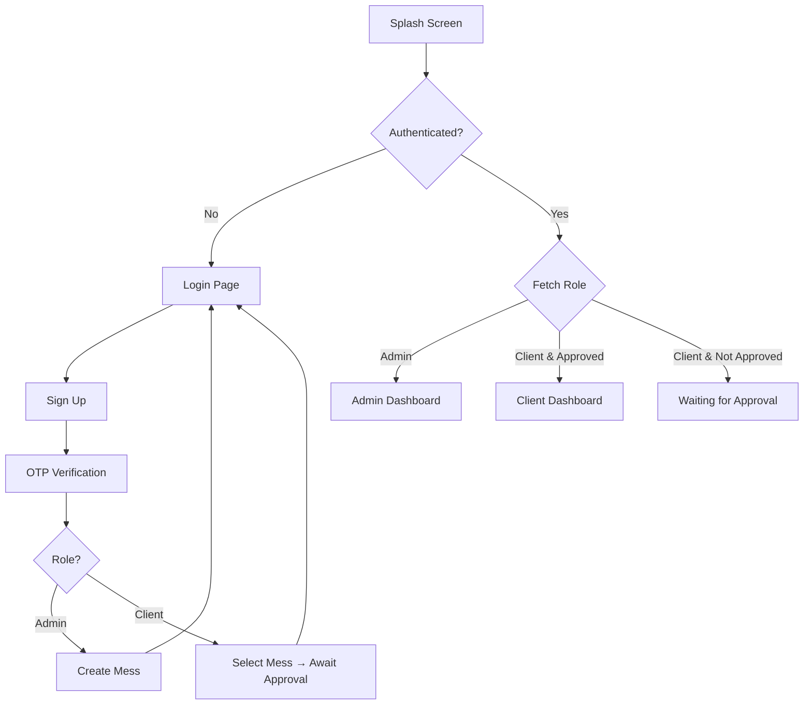

# 🍽️ Smart Mess App

A **multi-tenant mess (dining hall) management system** built with **Flutter** and **Firebase**. The app streamlines daily operations for both mess administrators and members — from menu planning and attendance tracking to availability management, diet balance monitoring, and member approvals.

> **Platform:** Flutter (Dart) + Firebase (Auth, Cloud Firestore)

---

## ✨ Features

### 🔐 Authentication (Firebase Phone + OTP)
- Phone number authentication with OTP verification
- Role-based access control — **Admin** & **Client**
- Auto-login via splash screen with role-based routing
- No plaintext passwords, no contact-number-as-ID

### 👨‍💼 Admin Panel

| Page | Feature | Description |
|------|---------|-------------|
| 2A | **Dashboard** | Quick access to menu, availability, members & notifications |
| 6 | **Menu Management** | Set/update daily morning & evening meal menus |
| 7B | **Availability List** | View available clients for each meal; generate attendance records |
| 8 | **Members Panel** | View all members, manage diet balances, handle deletions |
| 10 | **Client Detail** | Allocate diets, view individual member info |
| 5B | **Notifications** | Process approval & delete requests |

### 👤 Client Panel

| Page | Feature | Description |
|------|---------|-------------|
| 2B | **Dashboard** | Diet counter, today's menu, availability status |
| 7A | **Availability** | Toggle ON/OFF for meals (past 30 days view, next 7 days editable) |
| 4 | **Profile** | View & manage personal profile |
| 9A | **Change Password** | Firebase password update |
| 9B | **Change Phone** | Re-authenticate and update contact number |
| 5A | **Notifications** | View request statuses |

### 🏠 Mess Management
- **Create a Mess** (Page 3A) — Admins create a new mess group
- **Select/Join a Mess** (Page 3B) — Clients browse, select, and await approval

---

## 🏗️ Project Structure

```
smart_mess_app/
│
├── android/                          # Android platform files
├── ios/                              # iOS platform files
├── web/ | macos/ | windows/ | linux/ # Other platform targets
│
├── assets/
│   ├── images/
│   ├── icons/
│   └── fonts/
│
├── lib/
│   ├── main.dart                     # App entry point (Firebase init)
│   ├── app.dart                      # MaterialApp configuration
│   │
│   ├── core/
│   │   ├── constants/
│   │   │   ├── app_colors.dart       # Color palette
│   │   │   ├── app_strings.dart      # Static strings
│   │   │   ├── enums.dart            # UserRole, MealType, AvailabilityStatus, etc.
│   │   │   └── firestore_paths.dart  # Firestore collection path constants
│   │   │
│   │   ├── theme/
│   │   │   ├── app_theme.dart        # Light theme definition
│   │   │   └── text_styles.dart      # Typography styles
│   │   │
│   │   ├── utils/
│   │   │   ├── validators.dart               # Input validation
│   │   │   ├── date_utils.dart               # Date formatting helpers
│   │   │   ├── time_restriction_helper.dart  # Meal cutoff time logic
│   │   │   └── diet_calculation_helper.dart  # Diet deduction logic
│   │   │
│   │   ├── services/
│   │   │   ├── firebase_service.dart      # Firebase initialization
│   │   │   ├── auth_service.dart          # Phone auth + OTP
│   │   │   ├── firestore_service.dart     # Firestore CRUD operations
│   │   │   └── notification_service.dart  # In-app notifications
│   │   │
│   │   └── routes/
│   │       ├── app_routes.dart        # Route name constants
│   │       └── route_generator.dart   # Route generation logic
│   │
│   ├── models/
│   │   ├── user_model.dart            # User profile + role + mess info
│   │   ├── mess_model.dart            # Mess group data
│   │   ├── menu_model.dart            # Daily menu (morning/evening)
│   │   ├── diet_balance_model.dart    # Total & remaining diets
│   │   ├── availability_model.dart    # Per-meal availability status
│   │   ├── attendance_model.dart      # Attendance record
│   │   └── notification_model.dart    # Approval/delete requests
│   │
│   ├── repositories/                  # Data access layer (Firestore)
│   │   ├── auth_repository.dart
│   │   ├── user_repository.dart
│   │   ├── mess_repository.dart
│   │   ├── diet_repository.dart
│   │   ├── menu_repository.dart
│   │   ├── availability_repository.dart
│   │   ├── attendance_repository.dart
│   │   └── notification_repository.dart
│   │
│   └── features/
│       ├── auth/
│       │   ├── splash/               # Splash → auto-route by role
│       │   ├── login/                # Phone login
│       │   ├── signup/               # Registration + OTP
│       │   ├── otp/                  # OTP verification screen
│       │   ├── create_mess/          # Admin: create new mess
│       │   └── select_mess/          # Client: join existing mess
│       │
│       ├── client/
│       │   ├── dashboard/            # Diet counter, menu, status
│       │   ├── availability/         # Meal availability toggles
│       │   ├── notifications/        # Request status view
│       │   └── profile/              # Profile, change password/phone
│       │
│       ├── admin/
│       │   ├── dashboard/            # Admin home with quick actions
│       │   ├── menu/                 # Set daily menus
│       │   ├── availability_list/    # View available members
│       │   ├── members/              # Member list + client detail
│       │   └── notifications/        # Process approval/delete requests
│       │
│       └── shared_widgets/
│           ├── custom_button.dart
│           ├── custom_text_field.dart
│           ├── diet_counter_widget.dart
│           ├── menu_card_widget.dart
│           └── availability_toggle_widget.dart
│
├── firebase.json                     # Firebase project config
├── firestore.rules                   # Firestore security rules
├── firestore.indexes.json            # Firestore composite indexes
├── pubspec.yaml                      # Dependencies
└── README.md
```

---

## 🛠️ Tech Stack

| Layer | Technology |
|-------|------------|
| **Framework** | Flutter (Dart SDK ^3.10.8) |
| **Backend** | Firebase (Auth + Cloud Firestore) |
| **Auth** | Firebase Phone Authentication (OTP) |
| **State Management** | Provider |
| **Calendar** | table_calendar |
| **Local Storage** | shared_preferences |
| **Utilities** | intl (date formatting), uuid (ID generation) |

---

## �️ Firestore Data Model

All data is scoped by `messId` to ensure multi-tenant isolation.

### `messes/{messId}`
| Field | Type | Description |
|-------|------|-------------|
| `messName` | string | Unique name per admin |
| `createdBy` | uid | Admin who created it |
| `createdAt` | timestamp | Creation time |

### `users/{uid}`
| Field | Type | Description |
|-------|------|-------------|
| `name` | string | Display name |
| `contactNumber` | string | Phone number |
| `role` | `"ADMIN"` \| `"CLIENT"` | User role |
| `messId` | string | Associated mess |
| `approved` | boolean | Admin approval status |
| `permanentOff` | boolean | Permanently opt out of meals |
| `morningOff` | boolean | Morning meal opt-out |
| `eveningOff` | boolean | Evening meal opt-out |
| `createdAt` | timestamp | Registration time |

### `dietBalances/{uid}`
| Field | Type | Description |
|-------|------|-------------|
| `totalDiets` | number | Total allocated diets |
| `remainingDiets` | number | Remaining (never < 0) |
| `lastUpdated` | timestamp | Last modification time |

### `menus/{messId_date}`
| Field | Type | Description |
|-------|------|-------------|
| `messId` | string | Mess reference |
| `date` | string | `YYYY-MM-DD` |
| `morningMenu` | string | Morning meal items |
| `eveningMenu` | string | Evening meal items |
| `updatedBy` | uid | Admin who updated |
| `updatedAt` | timestamp | Update time |

### `availability/{uid_date_meal}`
| Field | Type | Description |
|-------|------|-------------|
| `uid` | string | User reference |
| `messId` | string | Mess reference |
| `date` | string | `YYYY-MM-DD` |
| `meal` | `"MORNING"` \| `"EVENING"` | Meal type |
| `status` | `"ON"` \| `"OFF"` | Availability |
| `locked` | boolean | Past cutoff = locked |

### `notifications/{notificationId}`
| Field | Type | Description |
|-------|------|-------------|
| `messId` | string | Mess reference |
| `type` | `"APPROVAL_REQUEST"` \| `"DELETE_REQUEST"` | Request type |
| `fromUid` / `toUid` | uid | Sender / receiver |
| `status` | `"PENDING"` \| `"ACCEPTED"` \| `"REJECTED"` | Current status |
| `createdAt` | timestamp | Request time |

### `attendance/{messId_date_meal}` + subcollection `records/{uid}`
| Field | Type | Description |
|-------|------|-------------|
| `messId` | string | Mess reference |
| `date` | string | `YYYY-MM-DD` |
| `meal` | string | Meal type |
| `records/{uid}.present` | boolean | Attendance status |

> 📌 **Retention rule:** Only the latest **3 attendance documents** per mess are retained.

---

## 🔄 Data Flow

```
Auth → Fetch user → Route by role
├── Client → Dashboard → Availability → Diet Deduction
└── Admin  → Menu → Attendance → Member Management
```

### 🍽️ Diet Deduction Logic
For each meal, a diet is deducted if **all** conditions are met:
- `permanentOff == false`
- `mealOff == false` (morningOff / eveningOff)
- `availability.status != "OFF"`
- `remainingDiets > 0`

### ⏰ Time Restrictions
| Meal | Cutoff | After Cutoff |
|------|--------|--------------|
| Morning | **7:00 AM** | Locked (no toggle) |
| Evening | **3:00 PM** | Locked (no toggle) |

---

## �🚀 Getting Started

### Prerequisites
- [Flutter SDK](https://docs.flutter.dev/get-started/install) (>= 3.10.8)
- [Firebase CLI](https://firebase.google.com/docs/cli)
- A Firebase project with **Phone Auth** & **Cloud Firestore** enabled

### Setup

1. **Clone the repository**
   ```bash
   git clone https://github.com/osctoss/smart_mess_app.git
   cd smart_mess_app
   ```

2. **Configure Firebase**
   ```bash
   dart pub global activate flutterfire_cli
   flutterfire configure
   ```
   - Enable **Phone Authentication** in Firebase Console
   - Enable **Cloud Firestore** in Firebase Console
   - Place `google-services.json` in `android/app/`
   - Place `GoogleService-Info.plist` in `ios/Runner/`

3. **Install dependencies**
   ```bash
   flutter pub get
   ```

4. **Deploy Firestore rules & indexes**
   ```bash
   firebase deploy --only firestore
   ```

5. **Run the app**
   ```bash
   flutter run
   ```

---

## � Security

### Firestore Rules
- All reads/writes are filtered by `messId`
- Clients cannot access data from other messes
- **Only Admin** can modify: menus, dietBalances, approvals
- **Only Client** can modify: their own availability & profile

### Gitignored Sensitive Files
| File | Reason |
|------|--------|
| `lib/firebase_options.dart` | Firebase API keys |
| `android/app/google-services.json` | Android Firebase config |
| `ios/Runner/GoogleService-Info.plist` | iOS Firebase config |
| `.env` / `.env.*` | Environment variables |
| `*.jks` / `*.keystore` / `key.properties` | Signing keys |

> ⚠️ **Each developer must generate their own Firebase config files using `flutterfire configure`.**

---

## �️ System Guarantees

- ✅ No negative diet balance
- ✅ No cross-mess data access  
- ✅ Only 3 attendance logs retained per mess
- ✅ Approval required before client can use the app
- ✅ Permanent OFF overrides manual meal toggles
- ✅ Time-restricted availability edits enforced

---

## 👥 User Flow



---

## 📄 License

This project is developed as part of an academic lab project.

---

<p align="center">Built with ❤️ using Flutter & Firebase</p>
